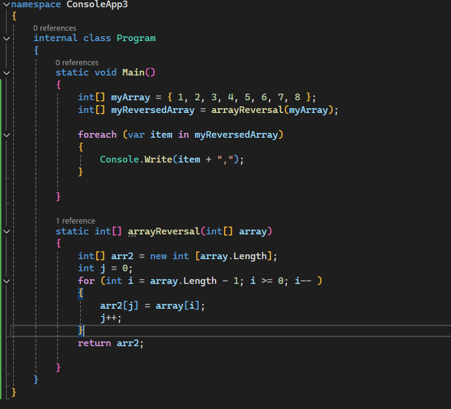

### Whiteboard Images

### Challenge A: Array Reversal

    Objective: Write a program to reverse a given array of integers.

Details:

The program should be implemented in C#.
An array of integers will be provided as input.
The goal is to create a new array that is the reverse of the input array.
The method arrayReversal should take an integer array as input and return a new array with the elements in reverse order.

### Challenge B: Most Frequent Number

    Objective: Write a program to identify the most frequent number in a given array of integers.

Details:

The program should be implemented in C#.
An array of integers will be provided as input.
The goal is to determine which integer appears the most frequently in the array.
The method mostFrequentNumber should take an integer array as input and return the most frequently occurring number.

