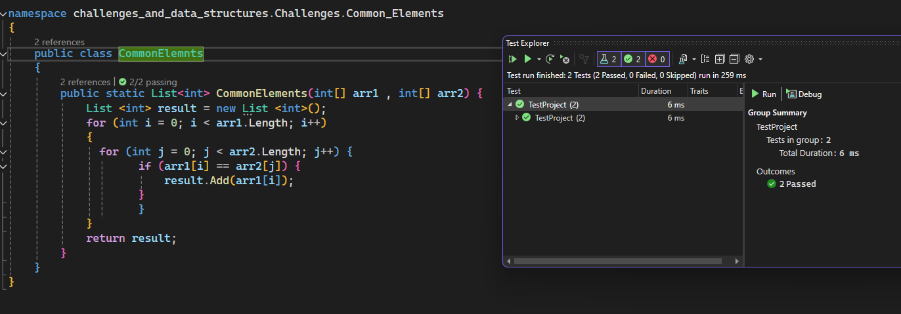
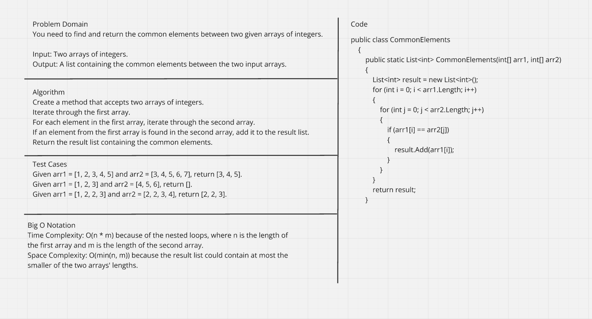

# Common Elements Challenge

## Challenge Description
This challenge requires you to find and return the common elements between two given arrays of integers. The solution should iterate through both arrays, identify common elements, and return them in a list.

## WhiteBoard 
